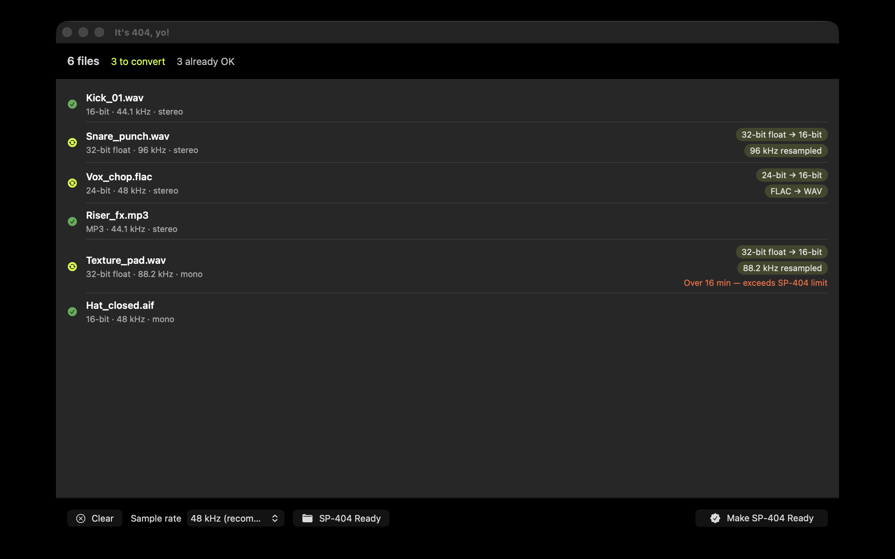

# It's 404, yo!

[](https://madebyhuman.iamjarl.com)
[](https://github.com/JarlLyng/its-404-yo/actions/workflows/ci.yml)
[](LICENSE)
[](#requirements)

**Make any sample pack SP-404 MkII–ready. No DAW, no terminal, no “Unsupported File.”**

A tiny, native macOS drag-and-drop utility that batch-converts a whole sample pack into the
format the Roland SP-404 MkII accepts on SD-card import — preserving your folder structure.
A sibling to [_It's mono, yo!_](https://itsmonoyo.iamjarl.com/).



---

## The problem

Professional sample packs are often **32-bit float** WAVs (and sometimes odd sample rates or
FLAC/M4A). When you drop them on an SD card, the SP-404 MkII rejects them with a cryptic
**“Unsupported File”** error and no explanation. The usual fixes — converting file by file in a
DAW, or wrangling `ffmpeg`/`sox` on the command line — are tedious across hundreds of samples.

## What it does

Drop a folder (or files) → see exactly what will change, in plain language → click
**Make SP-404 Ready** → get a converted copy that imports cleanly.

- **Analyzes** every file and tells you *why* it would fail (`32-bit float → 16-bit`,
  `96 kHz resampled`, `FLAC → WAV`).
- **Converts** to the documented safe target: **16-bit linear PCM WAV**, **48 kHz** (or 44.1),
  channels preserved, exotic metadata chunks stripped.
- **Copies** already-compatible files unchanged — no needless re-encoding.
- **Preserves** your folder structure in the output.
- **Warns** about edge cases (over 16 min / ~185 MB, or under 100 ms).

Everything runs **offline, on-device**. No network, no account, no data leaves your Mac.

## The target format (why these choices)

The SP-404 MkII processes audio internally at **16-bit linear PCM / 48 kHz** and conforms all
imports to it. Direct SD-card import accepts only **16-bit linear WAV/AIFF/MP3**; anything else
risks “Unsupported File.” See [`docs/build-spec.md`](docs/build-spec.md) for the full,
source-cited specification.

| Aspect | Rule |
| --- | --- |
| Codec | Linear PCM WAV |
| Bit depth | Force 16-bit (handles 32-bit float, 24-bit, …) |
| Sample rate | 48 kHz (default) or 44.1 kHz; resample anything else |
| Channels | Preserve mono/stereo |
| Metadata | Dropped via a clean WAV re-write |

## Requirements

- macOS 13 (Ventura) or newer
- [Xcode](https://developer.apple.com/xcode/) 16+ and [XcodeGen](https://github.com/yonaskolb/XcodeGen) to build from source

## Build from source

The Xcode project is **generated** from [`project.yml`](project.yml) (it is not committed).

```sh
brew install xcodegen      # one-time
make generate              # writes Its404Yo.xcodeproj
make open                  # open in Xcode
# or, headless:
make build
make test
```

See the [`Makefile`](Makefile) for the underlying commands.

## Architecture

A small SwiftUI app over a Core Audio conversion engine. See
[`docs/ARCHITECTURE.md`](docs/ARCHITECTURE.md).

- **UI:** SwiftUI, styled with the [IAMJARL design tokens](https://github.com/JarlLyng/iamjarl-design) Swift package.
- **Engine:** `ExtAudioFile` (AudioToolbox) — decode → 16-bit PCM → WAV, with sample-rate conversion.
- **No backend, no third-party runtime dependencies** beyond the design tokens.

## Roadmap

- [x] App icon (dark)
- [ ] Optional split for files over the 16 min / 185 MB limit
- [ ] Additional device profiles (Akai MPC, 1010music Blackbox/Bitbox)
- [ ] App Store release

## Credits

- Design tokens: [iamjarl-design](https://github.com/JarlLyng/iamjarl-design)
- Made by a human — [madebyhuman.iamjarl.com](https://madebyhuman.iamjarl.com)
- Format research draws on Roland’s official SP-404 MkII manuals and the community converters by
  [pkMinhas](https://github.com/pkMinhas/SP404WavConvertor),
  [seb-patron](https://github.com/seb-patron/SP404mk2-wav-converter), and others.

> *Roland and SP-404 are trademarks of their respective owners. This is an independent tool and is
> not affiliated with or endorsed by Roland.*

## License

[MIT](LICENSE) © 2026 Jarl Lyng
